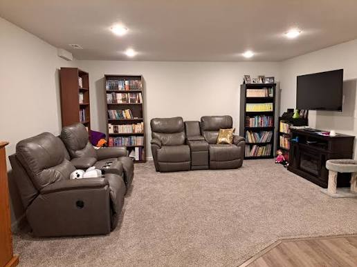
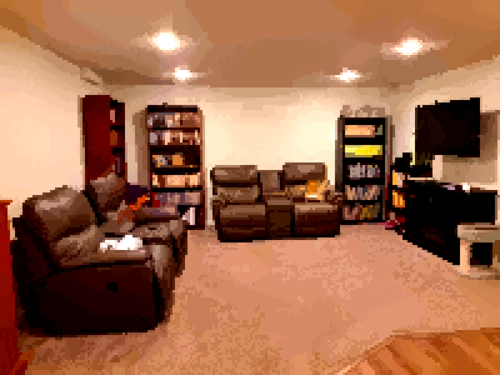
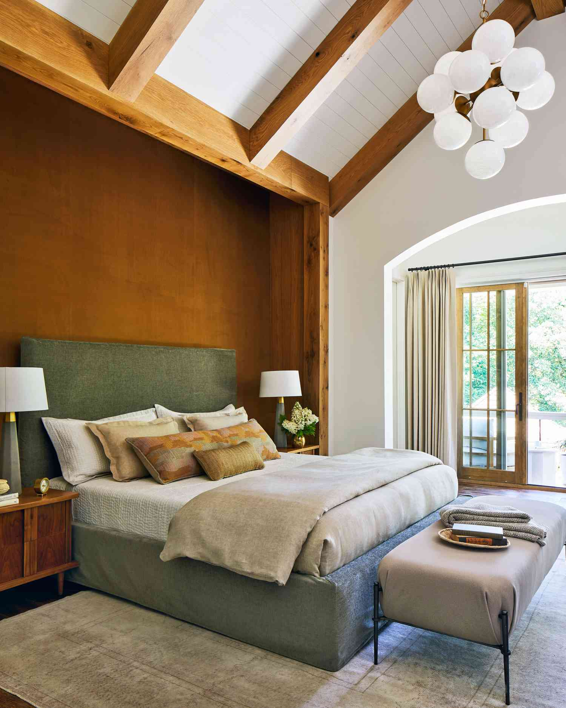
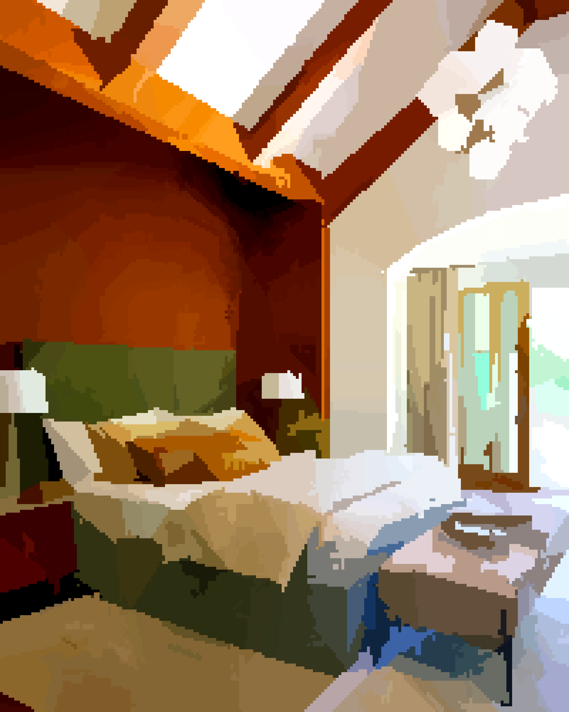
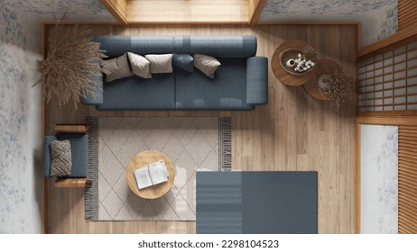
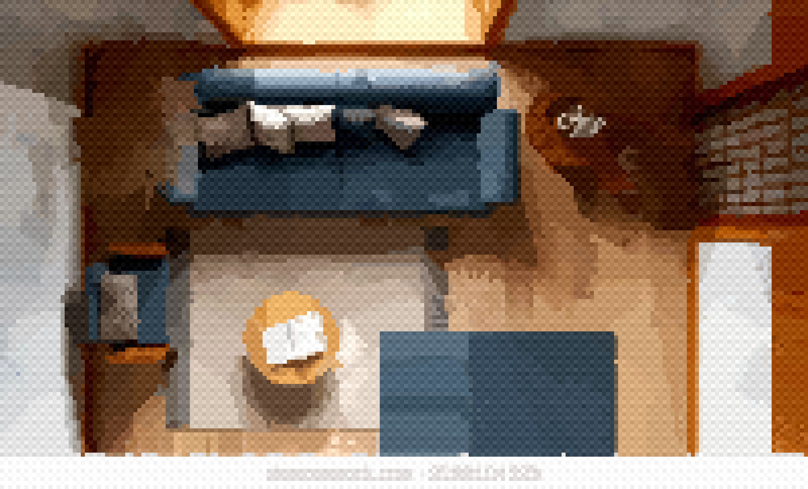
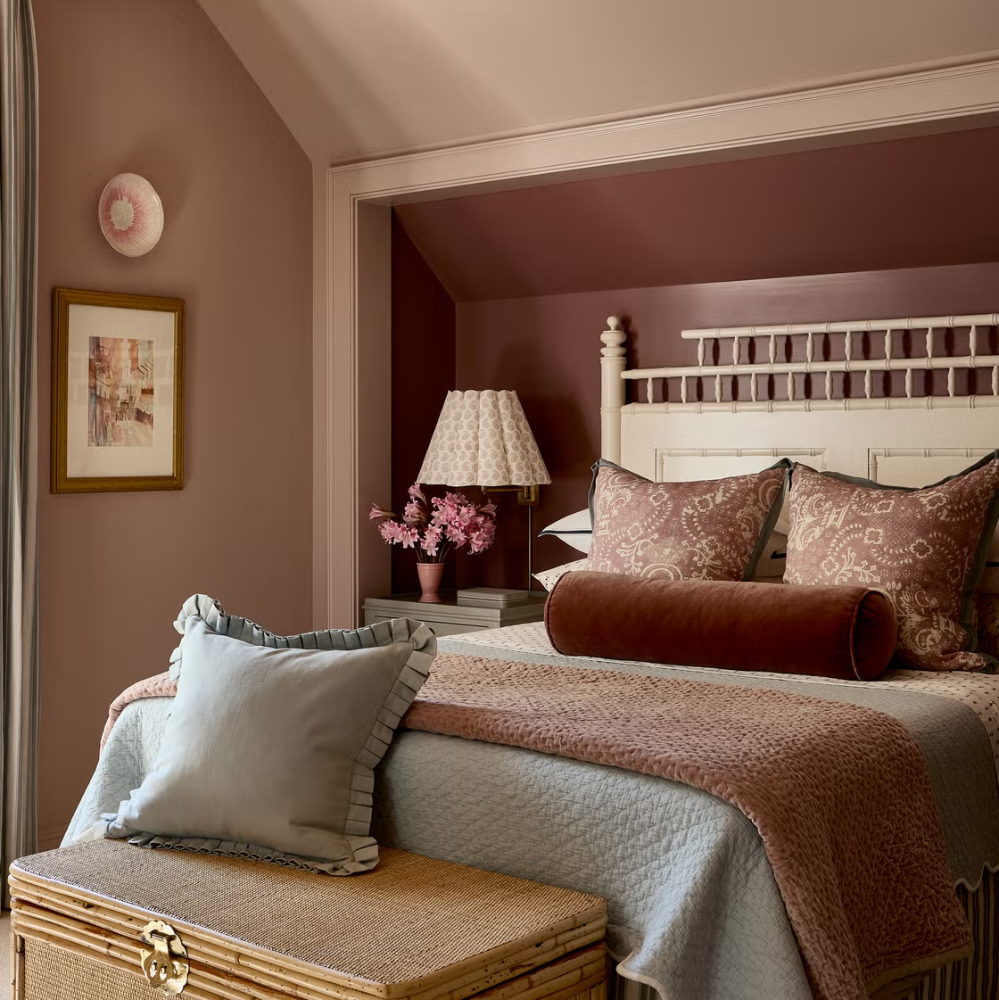
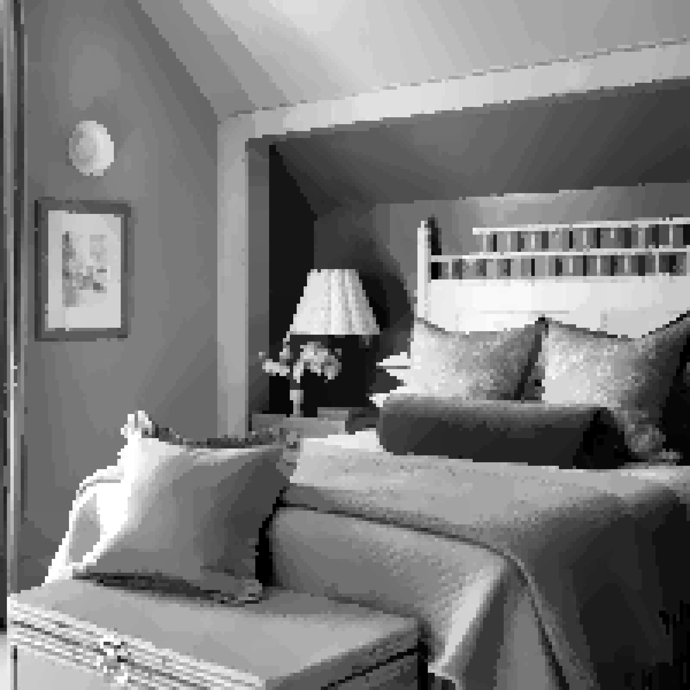

# Pixel Room Converter

Convert real photos of rooms into pixel art with a retro arcade or video game look, in the style of Undertale interiors.

Everything runs locally. No external APIs, no network calls, no ML models.

---

## Examples

| Source | Result |
|:---:|:---:|
| <br>**Original photo** | <br>**Arcade preset** |
| <br>**Original photo** | <br>**Simple style** |
| <br>**Original photo** | <br>**Dithered preset** |
| <br>**Original photo** | <br>**Gameboy preset** |

---

## Table of Contents

- [Features](#features)
- [Requirements](#requirements)
- [Installation](#installation)
- [Quick Start](#quick-start)
- [Presets](#presets)
- [CLI Reference](#cli-reference)
- [Light Extraction](#light-extraction)
- [How It Works](#how-it-works)
- [Project Structure](#project-structure)
- [Status](#status)
- [Roadmap](#roadmap)
- [License](#license)

---

## Features

| Feature | Description |
|---|---|
| Smart segmentation | Classical OpenCV computer vision detects objects and regions reliably |
| Per-region quantization | Each region gets its own palette based on internal color variation, so busy objects do not consume the entire color budget |
| Custom pixel grid | Any grid dimensions, for example 32x24 or 64x48 blocks |
| Region borders | Clean borders around detected regions with no duplicates where regions touch |
| Border straightening | Jagged boundaries snapped straight using least-squares line fitting |
| Dithering | Optional ordered Bayer dithering for a textured retro look |
| Light preservation | Extracts luminance variation from the photo and reapplies it to the result |
| Color boosting | Saturation and contrast adjustment for vivid output |
| Local processing | Runs entirely on your machine |

---

## Requirements

- Python 3.10 or newer
- Pillow, for image loading, resizing, saving, and drawing
- NumPy, for array-based pixel manipulation and color analysis
- OpenCV (`opencv-python`), for `cv2.pyrMeanShiftFiltering` and `cv2.connectedComponents`

---

## Installation

```bash
git clone <repository-url>
cd pixel-creation

python3 -m venv .venv
source .venv/bin/activate

pip install -r requirements.txt
```

---

## Quick Start

Run a preset:

```bash
python src/main.py --input room.jpg --output output.png --preset arcade
```

List the available presets:

```bash
python src/main.py --list-presets
```

Set the grid manually:

```bash
python src/main.py \
  --input room.jpg \
  --output room_pixel.png \
  --width 48 \
  --height 32
```

Typical run with common options:

```bash
python src/main.py \
  --input room.jpg \
  --output room_pixel.png \
  --width 48 \
  --height 32 \
  --colors 20 \
  --borders \
  --dither \
  --scale 16
```

---

## Presets

| Preset | Look | Equivalent flags |
|---|---|---|
| `arcade` | Bright and saturated, vibrant arcade colors | `--width 48 --height 32 --max-colors-per-region 6 --saturation 1.8 --contrast 1.5 --borders --border-size 2` |
| `undertale` | Dark and restrained, muted colors with clean borders | `--width 48 --height 32 --max-colors-per-region 4 --saturation 1.4 --contrast 1.2 --borders --border-color black` |
| `gameboy` | Monochrome, minimal color count | `--width 48 --height 32 --max-colors-per-region 1 --saturation 0.0` |
| `dithered` | Textured retro look with visible dithering | `--width 48 --height 32 --max-colors-per-region 3 --dither --dither-strength 0.12 --borders` |

Presets are a starting point. Any flag passed after a preset overrides that preset's value:

```bash
python src/main.py \
  --input room.jpg \
  --output output.png \
  --preset arcade \
  --border-color red \
  --width 64
```

---

## CLI Reference

### Required

| Flag | Description |
|---|---|
| `--input` | Path to the source image |
| `--output` | Path to save the result |
| `--width` | Number of pixel blocks across |

### Image grid

| Flag | Default | Description |
|---|---|---|
| `--height` | auto | Number of pixel blocks down. Calculated from width to keep aspect ratio |
| `--scale` | 16 | Final output size multiplier per block |

### Color budget

| Flag | Default | Description |
|---|---|---|
| `--colors` | 20 | Total color budget across the whole image |
| `--min-colors-per-region` | 1 | Minimum colors a single region can use |
| `--max-colors-per-region` | 4 | Maximum colors a single region can use |

### Segmentation

| Flag | Default | Description |
|---|---|---|
| `--spatial-radius` | 10 | How far apart pixels can be and still merge in `cv2.pyrMeanShiftFiltering` |
| `--color-radius` | 20 | How different colors can be and still merge |
| `--segmentation-max-dimension` | 500 | Longest side of the working photo before segmentation, used for speed |
| `--min-region-size` | 2 | Minimum block count before small regions are merged |

### Borders

| Flag | Default | Description |
|---|---|---|
| `--borders` | off | Enable region borders |
| `--border-size` | 2 | Border thickness in final pixels |
| `--border-color` | black | Border line color |
| `--max-deviation` | 2 | Maximum pixel distance for border straightening |
| `--min-boundary-length` | 4 | Minimum length before a boundary is straightened |

### Color adjustment

| Flag | Default | Description |
|---|---|---|
| `--saturation` | 1.5 | Saturation multiplier |
| `--contrast` | 1.3 | Contrast multiplier |

### Dithering

| Flag | Default | Description |
|---|---|---|
| `--dither` | off | Enable ordered dithering |
| `--dither-strength` | 0.08 | Strength of the dithering effect |

### Light extraction

| Flag | Default | Description |
|---|---|---|
| `--blur-radius` | 10 | Radius used to extract lighting patterns |
| `--light-strength` | 1.0 | How much of the lighting pattern is removed from the photo |
| `--reapply-strength` | 1.0 | How much of the lighting pattern is reapplied to the final image |

---

## Light Extraction

Light extraction helps most in rooms with a lot of light, where lamps, windows, and bright falloff carry a large part of the scene's character. It works well only when the initial light filtering is skipped and the pattern is applied on top of the quantized result:

```bash
python src/main.py \
  --input room.jpg \
  --output output.png \
  --light-strength 0.0 \
  --reapply-strength 1.0
```

With `--light-strength 0.0`, no luminance is stripped from the photo before segmentation, so fine detail is preserved. With `--reapply-strength 1.0`, the extracted lighting pattern is layered back onto the output, which keeps the sense of light direction and brightness gradients.

Raising `--light-strength` above 0 removes luminance information before quantization and tends to flatten small details. That path is still experimental.

---

## How It Works

| Stage | Step | Description |
|---|---|---|
| 1 | Light extraction (optional) | Extract luminance variation from the original photo |
| 2 | Segmentation | Flatten the image into color regions with `cv2.pyrMeanShiftFiltering`, then label each region with `cv2.connectedComponents` |
| 3 | Downscaling | Scale the color image and label map to the target block grid, using area averaging for colors and majority vote for labels |
| 4 | Small region cleanup | Merge tiny leftover regions into neighbors to remove noise |
| 5 | Border straightening | Fit lines to region boundaries and snap them straight |
| 6 | Color budget allocation | Decide how many colors each region gets based on its internal variation |
| 7 | Per-region quantization | Quantize each region using only that region's own pixel colors |
| 8 | Color boosting | Adjust saturation and contrast |
| 9 | Dithering (optional) | Apply ordered Bayer matrix dithering |
| 10 | Upscaling | Scale back up with nearest-neighbor interpolation to keep hard pixel edges |
| 11 | Border drawing (optional) | Draw borders along region boundaries |

---

## Project Structure

```
src/
├── main.py               Entry point, CLI argument parsing
├── pipeline.py           Orchestrates the full conversion pipeline
├── config.py             Default configuration values
├── segmentation.py       Full resolution segmentation using OpenCV
├── resize.py             Downscale and upscale image using Pillow
├── label_resize.py       Downscale label map using majority vote
├── color_budget.py       Allocate per-region color counts based on variation
├── palette.py            Per-region color quantization using Pillow's quantize
├── border_straighten.py  Line fitting algorithm to straighten boundaries
├── color_boost.py        Saturation and contrast adjustment using HSV
├── dither.py             Ordered Bayer matrix dithering
├── borders.py            Draw borders at region boundaries
└── light_extract.py      Extract and reapply luminance variations
```

---

## Status

| Component | State |
|---|---|
| Full resolution segmentation | Done |
| Label downscaling with majority vote | Done |
| Small region cleanup | Done |
| Border straightening with line fitting | Done |
| Per-region color quantization | Done |
| Color boosting | Done |
| Dithering support | Done |
| Border drawing | Done |
| Presets (arcade, undertale, gameboy, dithered) | Done |
| Light extraction | Partial. Reapply-only mode works well, full extraction needs tuning |

### Known issues

- Light extraction with `--light-strength` above 0 can reduce visibility of fine detail by removing luminance information. Keep it at 0.0 unless you are experimenting.
- Border straightening may over-straighten complex curved boundaries. Adjust `--max-deviation` and `--min-boundary-length` if this happens.

---

## Roadmap

- Batch mode to convert multiple photos at once
- Simple Tkinter GUI as an alternative to the CLI
- Palette locking to keep consistent colors across multiple images
- Alternative segmentation backends such as `cv2.watershed` for difficult photos
- Interactive boundary editor for manual region adjustment
- Additional presets, for example NES 8-bit

---

## License

MIT